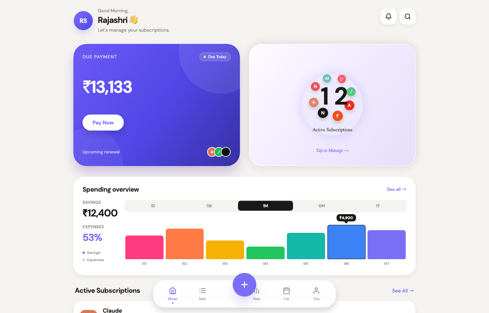
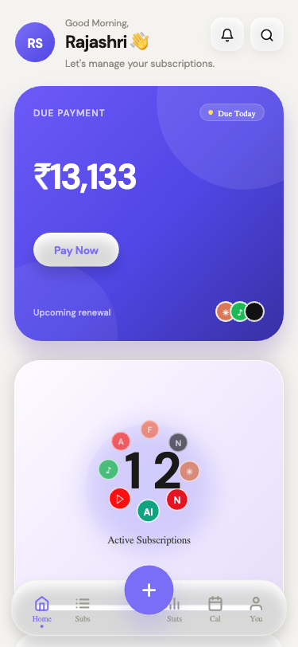
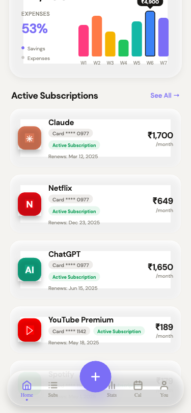

<div align="center">

# 💳 SubTrack

### A premium subscription tracker with a fintech-grade dashboard

Layered hero cards, an animated 8-icon orbit, a rainbow spending chart, and a real bottom-sheet management flow — built as a single Expo codebase that ships to iOS, Android, and Web.

<p>
  <a href="https://subs-track-indol.vercel.app"></a>
  <a href="https://github.com/pmdojo/SubsTrack"></a>
</p>

<p>
  
  
  
  
  
</p>

<br />



</div>

---

## 🎯 Live Demo

**→ [subs-track-indol.vercel.app](https://subs-track-indol.vercel.app)**

Works in any modern browser. Data persists locally per-device via AsyncStorage (localStorage on web).

---

## 📱 Screens

<table>
  <tr>
    <td align="center" width="50%">
      <br>
      <sub><b>Hero cards</b> — Due Payment gradient card and Active Subscriptions with a live 8-icon orbit around the count</sub>
    </td>
    <td align="center" width="50%">
      <br>
      <sub><b>Rainbow chart + list</b> — 1D / 1W / 1M / 6M / 1Y filters, hovering app tiles, inline card & renewal metadata</sub>
    </td>
  </tr>
</table>

---

## ✨ Features

### Home dashboard
- **Time-of-day greeting** (Good Morning / Afternoon / Evening) with pulse-ring avatar
- **Two hero cards** side-by-side on tablet+ / stacked below 480px
  - **Due Payment** — animated INR counter tweens 0 → total, gradient background, "Due Today / Tomorrow / in N days" chip, `Pay Now → Processing… → Paid ✓` state machine, upcoming-renewal mini icons
  - **Active Subscriptions** — 8 app icons in a fixed 130px orbit around a slot-machine "12" counter, ambient glow, hover slows orbit 40%, tap gathers icons to center
- **Spending overview** — rainbow (pink → purple) bar chart with a dark tooltip caret over the peak; 5 time filters swap datasets with a spring transition
- **Active Subscription list** — floating white cards with soft shadows; each app icon idle-bobs with a per-row stagger; long-press reveals inline **Edit** / **Delete**
- **Notification bell** turns on when any active sub bills within 7 days

### Subscription detail sheet
Tap any row → slides up a full-height bottom sheet:
- Big icon tile, name, category, status badge
- **Next charge** panel with date
- 6-tile meta grid (Amount, Billing Cycle, Card, Renewal, Category, Status)
- Primary **Manage Subscription**
- 7 secondary actions: Pause / Renew Now / Change Payment Method / Reminder Settings / Export Invoice / View Billing History / **Cancel Subscription** (destructive, red)
- Confirmation dialog for Pause & Cancel
- Toast for non-destructive actions

### Bottom navigation
5-tab shell (Home / Subs / Stats / Cal / You) with a centered floating **+** action that opens the Add modal.

### Add / Edit modal
- Bottom sheet with spring animation and backdrop blur
- Emoji icon input + color picker (color swatch + hex text)
- Animated status toggle (Active ↔ Expired) with a spring thumb
- Field validation, success toast

### Micro-interactions everywhere
Rolling per-digit counter, spring-in bars, hovering icons, pulse rings, tap-scale press states, staggered section fade-ins — all subtle, no gimmicks.

---

## 🛠 Tech Stack

| Layer | Choice |
|---|---|
| Framework | **Expo 51** (SDK 51) — one codebase for iOS / Android / Web |
| UI runtime | **React Native 0.74** + **react-native-web 0.19** |
| Language | **TypeScript 5.3** |
| Animation | **React Native Reanimated 3** for orbit math, plus a custom lightweight **Moti-compatible shim** (`src/lib/motion.tsx`) so no external motion library is needed on Web |
| Charts | Hand-rolled SVG bars (no chart library dep) |
| Icons | `@expo/vector-icons` (Feather set) |
| Fonts | **DM Sans** via `@expo-google-fonts/dm-sans` |
| Storage | `@react-native-async-storage/async-storage` (falls through to `localStorage` on Web) |
| Gradients | `expo-linear-gradient` |
| Deployment | **Vercel** (static Expo Web export) with auto-deploy on `git push` |

---

## 🏗 Architecture

```
SubsTracker/
├── expo/                              ← the app
│   ├── App.tsx                        ← font loader + SafeAreaProvider wrapper
│   ├── app.json                       ← Expo config
│   ├── babel.config.js                ← reanimated plugin
│   ├── package.json                   ← Expo/React Native deps
│   └── src/
│       ├── theme.ts                   ← colors, radius, spacing, elevation, font tokens
│       ├── lib/
│       │   ├── types.ts               ← Subscription type
│       │   ├── data.ts                ← 13-sub seed (12 active + 1 expired)
│       │   ├── store.ts               ← AsyncStorage CRUD + formatINR()
│       │   └── motion.tsx             ← Moti-compatible shim over RN Animated
│       ├── screens/
│       │   └── HomeScreen.tsx         ← composes everything, breakpoint logic
│       └── components/
│           ├── Header.tsx             ← greeting + avatar + bell/search
│           ├── DuePaymentCard.tsx     ← gradient card, counter, Pay Now
│           ├── ActiveSubsHeroCard.tsx ← 130px orbit + rolling number
│           ├── SpendingOverview.tsx   ← rainbow bars + tabs + tooltip
│           ├── SubList.tsx            ← floating rows with hovering icons
│           ├── SubDetailSheet.tsx     ← bottom-sheet management flow
│           ├── AddSubModal.tsx        ← create/edit form
│           ├── BottomNav.tsx          ← 5-tab bar + FAB
│           ├── AnimatedCounter.tsx    ← number tween
│           ├── RollingNumber.tsx      ← slot-machine per-digit counter
│           ├── OrbitIcon.tsx          ← individual orbiting sprite
│           └── MiniBars.tsx           ← reusable SVG bar chart
├── docs/screenshots/                  ← images used in this README
├── vercel.json                        ← build config for Vercel
├── app/                               ← legacy Next.js scaffold (not deployed)
└── README.md
```

### How the orbit works

One shared `Animated.Value` tweens `0 → 1` on an 18-second linear loop. For each of the 8 icon slots, `phase.interpolate(...)` is called with a 60-sample `outputRange` computed from `cos/sin(2π · (t + i/8))`, giving each icon its own path with a distinct phase offset. Depth cues (scale 0.85 → 1.05, opacity 0.55 → 1) come from the same phase interpolation using `sin(angle)`. One animated node drives eight visual sprites — cheap enough to stay at 60fps everywhere.

### How persistence works

`src/lib/store.ts` wraps `AsyncStorage.getItem/setItem` in try/catch. On first launch it seeds 13 subscriptions from `src/lib/data.ts`. All state changes go through both `setState` and `saveSubs()` so the UI is instant and the data survives page reloads. On Web, AsyncStorage transparently uses `localStorage`.

---

## 🚀 Installation

### Prerequisites
- **Node 18+** (this repo was built on Node 24.18 via nvm)
- **Watchman** (macOS) — `brew install watchman`. Skip and you'll hit `EMFILE: too many open files, watch` because Metro exceeds macOS's per-process file-descriptor cap
- **Expo Go** app on your phone if you want to run natively without Xcode / Android Studio

### Clone and install

```sh
git clone https://github.com/pmdojo/SubsTrack.git
cd SubsTrack/expo
npm install
```

### Run

```sh
# Web (opens http://localhost:8081)
npm run web

# iOS Simulator (needs Xcode)
npm run ios

# Android emulator (needs Android Studio)
npm run android

# Physical device via Expo Go
npm start          # scan the QR code with Expo Go
```

### Build for production

```sh
npm run build:web
# → outputs static site to expo/dist/
```

### Deploy to Vercel

The repo already has a `vercel.json` — Vercel auto-detects it. Just import the repo at [vercel.com/new](https://vercel.com/new), leave all fields blank, click **Deploy**. Every subsequent `git push` triggers a redeploy.

---

## 🗺 Roadmap

Delivered ✅
- [x] Two-card hero (Due Payment + Active Subscriptions)
- [x] 8-icon circular orbit with depth (scale + opacity)
- [x] Rainbow bar chart with 1D/1W/1M/6M/1Y filters and peak tooltip
- [x] Floating subscription list with hovering icons
- [x] Full subscription detail bottom sheet (8 actions + confirmations)
- [x] Add / Edit modal with animated status toggle
- [x] Bottom navigation shell with centered FAB
- [x] Responsive: stack ≤ 480, side-by-side ≥ 480, wider container ≥ 768
- [x] AsyncStorage persistence (Web falls through to localStorage)
- [x] INR formatting via `Intl.NumberFormat('en-IN')`
- [x] Deployed to Vercel with auto-deploy on push

Next up 🚧
- [ ] **Onboarding flow** (5 screens: Welcome → Connect email → Reminder prefs → Payment methods → Home)
- [ ] **Multi-step Add wizard** (Search app → Amount → Cycle → Payment → Reminder → Save) to replace the single-form modal
- [ ] Real bodies for **Subs / Analytics / Calendar / Profile** tabs (currently placeholder)
- [ ] **Radial menu** expansion from the FAB
- [ ] **New-sub fly-in** animation from the FAB into the orbit slot when a subscription is added
- [ ] iOS + Android native builds via **EAS Build**
- [ ] **Widget** and Home Screen quick actions

Later ideas 💭
- [ ] Email/receipt parsing to auto-import subscriptions
- [ ] Multi-currency support with live FX
- [ ] Shared household plans (split billing between users)
- [ ] Category-based spending caps with notifications
- [ ] CSV / PDF export of billing history

---

## 📄 License

MIT — do whatever you want with it. Attribution appreciated but not required.

---

<div align="center">
<sub>Built with Claude Code · Deployed on Vercel · Ships to iOS, Android, and Web from one codebase.</sub>
</div>
